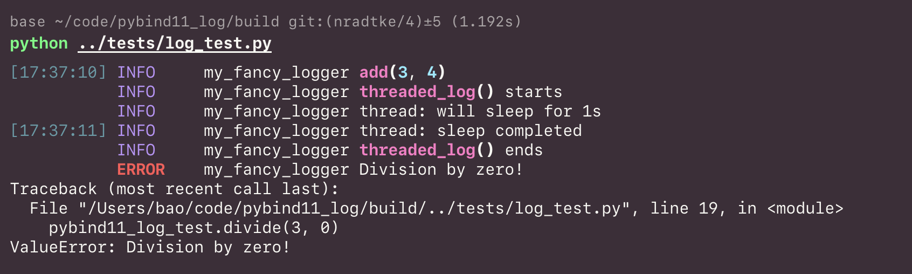

# pybind11_log

A bridge from C++ to Python logging. Inspired by
[pyo3_log](https://docs.rs/pyo3-log/latest/pyo3_log/).

This works by routing the logging calls, e.g. `spdlog::info`, to the Python
`logging` module. This is done by setting the `spdlog::logger`'s `sink` to a
custom router sink. The router sink then calls the Python `logging` module.

For thread-safe logging, please use `pybind11_log::init_mt()` to initialize
the logger. For single-threaded applications, use `pybind11_log::init_st()`.

## Usage

The library is header-only, so you can just include the header file
`include/pybind11_log.h` in your project.

```cpp
#include "pybind11_log.h"

#include <pybind11/pybind11.h>
#include <spdlog/spdlog.h>

#include <thread>

int add(int i, int j) {
  spdlog::info("add({0}, {1})", i, j);
  return i + j;
}

int divide(int i, int j) {
  if (j == 0) {
    spdlog::error("Division by zero!");
    throw std::invalid_argument("Division by zero!");
  } else {
    spdlog::info("divide({0}, {1})", i, j);
  }
  return i / j;
}

void sleep_and_log() {
  spdlog::info("thread: will sleep for 1s");
  sleep(1);
  spdlog::info("thread: sleep completed");
}

void threaded_log() {
  py::gil_scoped_release release;  // Release the GIL when working with threads
  spdlog::info("threaded_log() starts");
  std::thread t1(sleep_and_log);
  t1.join();
  spdlog::info("threaded_log() ends");
}

void init(const std::string& logger_name) {
  pybind11_log::init_mt(logger_name);
}

PYBIND11_MODULE(pybind11_log_test, m) {
  m.doc() = "pybind11_log example plugin";
  m.def("init", &init, "Initialize the logger");
  m.def("add", &add, "A function which adds two numbers with logging");
  m.def("divide", &divide, "A function which divides two numbers with logging");
  m.def("threaded_log", &threaded_log,
        "A function which sleeps and log in a thread");
}
```

You can then test that the logging works by running the following Python code:

```python
import logging
import os
import sys

sys.path.append(os.getcwd())

from rich.logging import RichHandler

logging.basicConfig(
    level="NOTSET", format="%(name)s %(message)s", datefmt="[%X]", handlers=[RichHandler()]
)

import pybind11_log_test

if __name__ == "__main__":
    pybind11_log_test.init("my_fancy_logger")
    pybind11_log_test.add(3, 4)
    pybind11_log_test.threaded_log()
    pybind11_log_test.divide(3, 0)
```

As shown in the terminal output below, the logging calls are routed to Python
`logging` from the C++ code.

